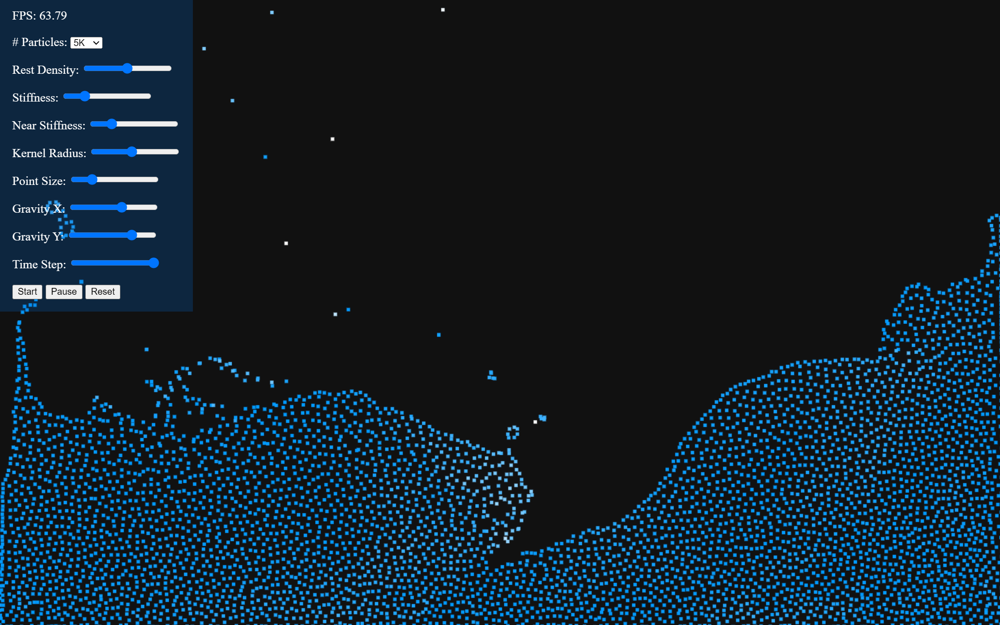

# Particle-based Viscoelastic Fluid Simulation Implementation
Implementation of the paper Particle-based Viscoelastic Fluid Simulation (Simon Clavet, Philippe Beaudoin, and Pierre Poulin)
[https://dl.acm.org/doi/10.1145/1073368.1073400](https://dl.acm.org/doi/10.1145/1073368.1073400)

# Demo
https://kotsoft.github.io/particle_based_viscoelastic_fluid/

# sim_0.js
Implements up to and including Section 3, Simulation Step. Similar to verlet integration, we also track position, and previous position, and use those to compute velocity. Velocity is also stored to be further operated on in the viscosity step.

# sim_1.js
Implements Section 4, Double Density Relaxation, but neighbor search is O(n^2). Note that for this paper, the inner j loop starts at 0 and not i + 1.

# sim_2.js
Implements spatial hashing. You can toggle on/off to see the performance difference.
Resources:
- Ten Minute Physics (Matthias Müller)
https://matthias-research.github.io/pages/tenMinutePhysics/index.html
- Diligent Engine Tutorial
https://github.com/DiligentGraphics/DiligentSamples/tree/cd125c95c2fac5da5b05b1e648c99be97a885263/Tutorials/Tutorial14_ComputeShader

# sim_3.js
Iterates through active buckets instead of via particles to try to get more locality.

# sim_4.js (skipped, didn't finish yet)
I wanted to see if I could set up some caches around each bucket I iterate to get a further perf increase.

# sim_5.js
Implements Section 5, elasticity and viscosity. Spring adjustment is where I had to make some changes to the paper to improve stability.
- Alg. 4, Ln. 5 - New springs are added with rest length starting at the current distance between the particles (r_ij) instead of h
- Moved where the new springs are added to inside the double-density relaxation method (loop combining optimization)
- Added a parameter of min dist for springs so springs that are too short aren't created when the material is slammed
- Alg. 5 - Added clamp to the inward radial velocity

# scrap_0.js
An unfinished experiment to apply position corrections all at once, rather than sequentially as they are done in the paper. Sequential position corrections is biased, so it causes many swirls to appear, as well as it needs both read and write access to the positions and presents some challenges when multithreading.

# Support further development
If you would like to see more features (e.g. multi-material, rigid bodies) and more optimizations (e.g. SoA version), or if you'd like to support development of my sandbox Liquid Crystal https://kotsoft.itch.io, donations are greatly appreciated.

